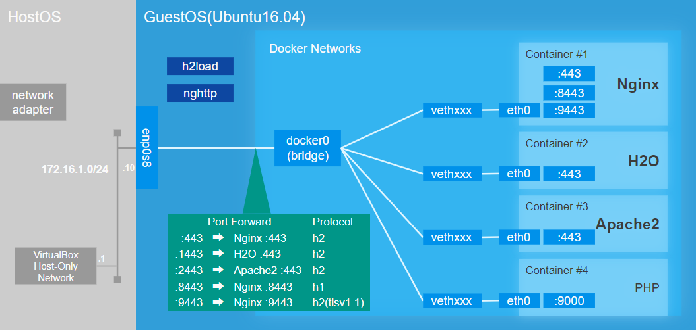
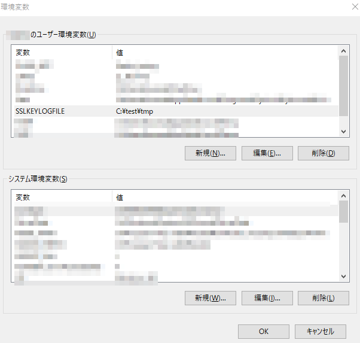
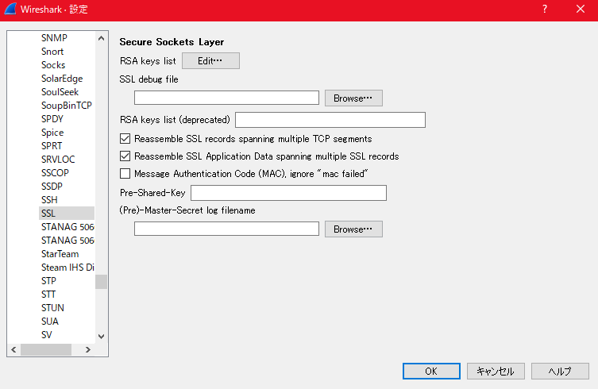

# HTTP2-LAB
## はじめに
九州セキュリティカンファレンス 2018で発表した「HTTP/2ことはじめ」の資料とデモ用のプログラムを公開しています。

## 前提条件
本プログラムを実行するには、VirtualBox及びVagrantが必要です。
仮想マシンとのネットワークに`172.16.1.0/24`のネットワークを使用します。
既存のネットワークで同じネットワークアドレスを使用している場合は、競合しないように変更していただくか、Vagrantfileの設定を変えてください。設定方法は __仮想マシンのネットワークの変更__ をご参照ください。

## セットアップ
1. `Vagrantfile`が置いてあるフォルダと同じ階層で`vagrant up`を実行してください。初回実行時は、仮想マシンを作成しているため数分から数十分かかる場合があります。
2. `vagrant ssh`を実行し、仮想マシンにログインしてください。
3. `cd http2-lab`を実行し、階層を移動してください。
4. `sudo docker-compose up -d`を実行することで各dockerが立ち上がります。初回実行時は、Dockerイメージをダウンロードするため数分から数十分かかる場合があります。
5. ホストOSのhosts設定に以下の行を追加してください。Vagrantfileのネットワーク設定を変更している場合は、IPアドレスの箇所を適宜置き換えてください。
    > 172.16.1.10 http2-lab
6. ブラウザから`https://http2-lab`と入力すると証明書の警告画面が表示されますので、例外設定もしくは警告を無効にしてアクセスしてください。

## 終了方法
1. 仮想マシン内でhttp2-labのフォルダに移動してください。
2. `sudo docker-compose stop`を実行し、起動中のDockerコンテナを終了させてください。
3. `exit`を実行し、仮想マシンのシェルから抜けてください。
4. `vagrant halt`を実行し、仮想マシンをシャットダウンします。

## 環境構成

## 仮想マシンのネットワークの変更
1. 仮想マシンが起動している場合は、シャットダウンを行ってください。
2. Vagrantfileを開き、次の行のIPアドレスを任意のIPアドレスに変更してください。
    >  config.vm.network "private_network", ip: "172.16.1.10"
3. 仮想マシンを起動してください。
4. 仮想マシンのコンソールで`ifconfig`を実行し、enp0s8インタフェースが指定したIPアドレスになっているか確認してください。

## 使い方
このデモサイトには以下のコンテンツが含まれています。
* 各webサーバへのアクセス機能
    アクセスする際のポートに応じてwebサーバを切り替えます。
        443 : nginx
        1443: h2o
        2443: apache2
* GET、POSTリクエスト
    単純なGETとPOSTをリクエストすることができます。
* ファイルアップロード
    ファイルのアップロードを行います。アップロードされたファイルは、`\http2-lab\html\img\uploads`配下に配置されます。
* サーバプッシュ
    3通りのサーバプッシュを用意しています。
    1. webサーバにプッシュ用リソースを事前に設定(Nginx,apache2)
    2. Linkヘッダを使ったプッシュプリロード(nginx,h2o,apache2)
    3. Linkタグを使ったプッシュプリロード(TODO)
* 画像同時リクエスト
    一枚の画像を分割し、分割した数だけ画像リクエストを実施します。
* XSS
    XSSの脆弱性が存在するページ
* Header Injection
    Nginxでのみ動作します。JSONのファイル名が、HTTPヘッダの`X-ACTION`に設定されるようになっています。
* phpinfo
    PHPINFOを表示します。

## 検証方法
`デモシナリオ.md`をご確認ください。

### Wiresharkのデバッグ設定
Wiresharkでブラウザ(Chrome及びFirefox)のHTTP/2通信を見る場合は、TLSで暗号化された通信を復号する必要があります。
ブラウザの実装では、事実上TLSv1.2以上の暗号スイートの復号を必要とし、(P)FS((Pertfect) Forward Secrecy)の性質を持つ鍵交換方式では、秘密鍵をWiresharkに設定してもブラウザの通信の復号することはできません。
(P)FSの通信をキャプチャするためには、以下の設定を行ってください。

1. `SSLKEYLOGFILE`環境変数にダンプファイルのパスを設定してください。

2. Wiresharkを開き、[編集]→[設定]→[Protocols]→[SSL]の画面を開く。

3. (Pre)-Master-Secret log filenameで`SSLKEYLOGFILE`で指定したファイルパスを指定する。

WiresharkでTLSが復号できない場合は、TLSのClient Helloパケットをキャプチャできるように、コネクションを張りなおしてください。
具体的には、ブラウザを開いている場合は、一度閉じてから開きなおすことでコネクションを張りなおします。

